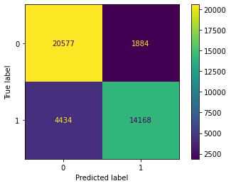

# Tanzanian Water Well Data
A look into Tanzanian water points through classification


Presented by: Rachel Edwards, Svitlana Glibova

## Overview
Our project takes a look at the factors that gp into determinig if water points in Tanzania are functional or not. We hope to build a tool through statistical analysis and modeling that can accurately predict the functionality of one of these water points. These predictions will help us better serve the needs of the Tanzanian Ministry of Argiculture, Food Securtiy and Cooperatives as they contiune to try and supply Tanzania with clean safe water. 


## Business Problem
Over 50% of Tanzania's GDP rely on livestock and agriculture while 80% of employment is directly related to those fields, which are very reliant on proper water resource management. These water pumps are used by millions all over Tanzania as you can see in the population chart. The management of these water resources is vital to the citizens of Tanzania, especially in locations that have fewer functioning pumps than non-functioning. Our goal is to provide the Ministry with a way to predict whether a certain pump needs repair, while optimizing for the least amount of false negatives. False negative, predicting that pump is safe and working when in reality it isn't, could be potentially dangerous to the citizens of Tanzania and costly for the government.


## Data
The data for our project has been collected and curated by [Taarifa](http://taarifa.org/) and the [Tanzanian Ministry of Water](https://www.maji.go.tz/). It consists of 39 possible contributing factors for our predictions that include geographical data about Tanzania and its basins, who funds and manages these water pumps, how they are paid for and the populations that rely on them for safe clean water. The files and instruction on how to access them can be located in the data folder. Documentation for the data set can be found [Here](https://www.drivendata.org/competitions/7/pump-it-up-data-mining-the-water-table/page/25/)


## Methods
The methods used for this analysis start with exploratory data analysis where we look for correlations between the data and target and clean and pre-process our data. We then use folium to produce geographically accurate maps of Tanzania to privide visualizations of the data. We also use statistical modeling to make predictions based on our EDA and an iterative model tuning processas we search for the best recall score.


## Results
Intital Model


Accuracy: 54.6%
Recall: 0%
Precision: undefined  
The initial dummy model predicted only that the pump is functional due there being more functional pumps in the data set.  


XGB Vanilla Model


Accuracy: 78.6%
Train Recall: 68.7%
Test Recall: 66.3%  
The inital XGB model performed best on this data set, so we proceeded to use hyperparameter tuning to increase the recall with keeping accuracy in mind as well.  

## Conclusions
Final Model


Train Recall: 76.4% 
Test Recall: 69.8%  

The final model did see some overfitting, which we would like to mitigate with further feature selection and parameter tuning.  
        
 

### Next Steps
Strengthen feature selection for the model and continue tuning hyperparameters to reduce the number of false negative predictions.

Suggest an update for pump infrastructure

Suggest cross-regional communication

## For More Information
For more information on our data, the competition and related topics check out the [Driven Data Website](https://www.drivendata.org/competitions/7/pump-it-up-data-mining-the-water-table/page/23/)
For more information on the specific basins mentioned in these projects:

[Pangani River](https://en.wikipedia.org/wiki/Pangani_River)

[Lake Victoria](https://en.wikipedia.org/wiki/Lake_Victoria)

[Lake Nyasa](https://en.wikipedia.org/wiki/Lake_Malawi) **sometimes refered to as Lake Malawi*

[Lake Rukwa](https://en.wikipedia.org/wiki/Lake_Rukwa)

[Lake Tanganyika](https://en.wikipedia.org/wiki/Lake_Tanganyika)

[Rufiji River](https://en.wikipedia.org/wiki/Rufiji_River)

[Wami/Ruvu](https://en.wikipedia.org/wiki/Wami_River)

[Ruvuma River](https://en.wikipedia.org/wiki/Ruvuma_River)

## Repository Structure
```
├── data - contains information on obtaining the data set
├── img
├── notebooks
├── src
  ├── transformers.py
  ├── wtpts_env.yml
├── Phase_3_Project_Rachel-binary.ipynb
├── Phase_3_Project_Rachel-binary_merged.ipynb
├── README.md
├── Tanzanian_Waterpoints.ipynb
└── svitlana_first_eda.ipynb
```
